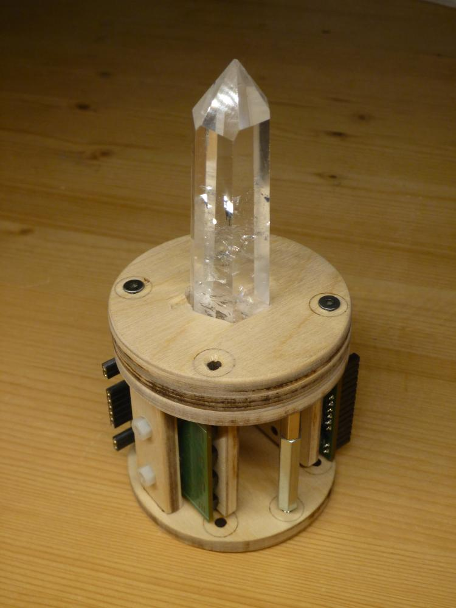

# LEDBoard_4x4_16bit_Mounting
Examples of Mounting Variants for the LEDBoard_4x4_16bit Modules

## [Mounting Sun](https://github.com/s-light/LEDBoard_Layout_Sun)

## [Mounting Lightguide Spot and CrystalLight](mounting_lightguideto.md)

