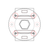
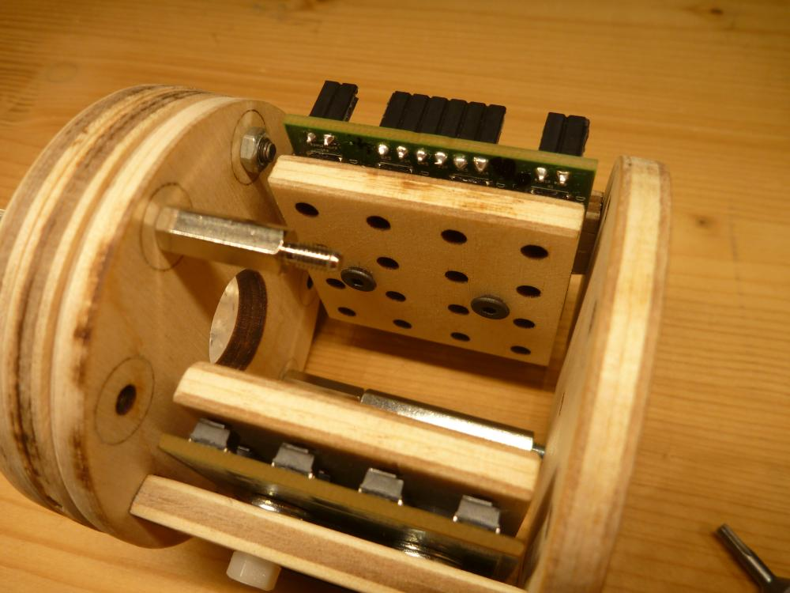

<!--lint disable list-item-indent-->
<!--lint disable list-item-bullet-indent-->

# Instructions for 'Mounting Lightguide Spot' and CrystalLight

## CrystalLightV2
based on the mounting_lightguide_spot_17mm

full design: [mounting_lightguide_spot_17mm.svg](mounting_lightguide_spot_17mm/mounting_lightguide_spot_17mm.svg)

Wood-thickness: 5mm

### Parts-list
- 1x [mounting_lightguide_spot_17mm_layer_bottom_wood.svg](mounting_lightguide_spot_17mm/mounting_lightguide_spot_17mm_layer_bottom_wood.svg)
- 1x [mounting_lightguide_spot_17mm_layer_crystal1_wood.svg](mounting_lightguide_spot_17mm/mounting_lightguide_spot_17mm_layer_crystal1_wood.svg)
- 1x [mounting_lightguide_spot_17mm_layer_crystal2_wood.svg](mounting_lightguide_spot_17mm/mounting_lightguide_spot_17mm_layer_crystal2_wood.svg)
- 2x [mounting_lightguide_spot_17mm_layer_LEDBoard_wood.svg](mounting_lightguide_spot_17mm/mounting_lightguide_spot_17mm_layer_LEDBoard_wood.svg)
- 1x [mounting_lightguide_spot_17mm_layer_spot_wood.svg](mounting_lightguide_spot_17mm/mounting_lightguide_spot_17mm_layer_spot_wood.svg)
- 1x [mounting_lightguide_spot_17mm_spacer_wood.svg](mounting_lightguide_spot_17mm/mounting_lightguide_spot_17mm_spacer_wood.svg)
- 6x [countersunk screw M3x20mm](https://www.wegertseder.com/ArticleDetails.aspx?ANR=2598-436)
- 4x [countersunk screw M3x12mm](https://www.wegertseder.com/ArticleDetails.aspx?ANR=2598-430)
- 8x [bolt M3](https://www.wegertseder.com/ArticleDetails.aspx?ANR=4445-100)
- or 8x [bolt M3](https://www.wegertseder.com/ArticleDetails.aspx?AKNUM=3991)
- 8x [plate M3](https://www.wegertseder.com/ArticleDetails.aspx?AKNUM=4419-100)

### Photos

